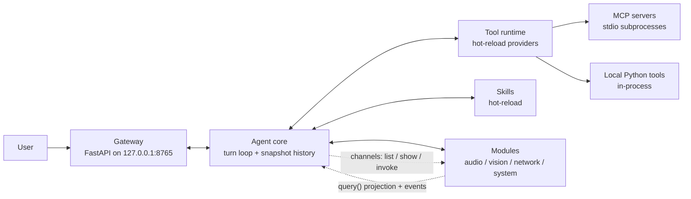
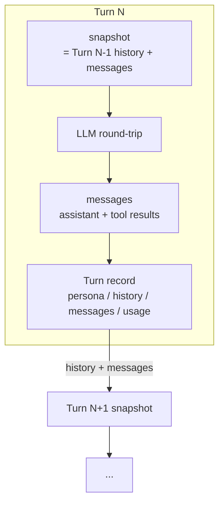
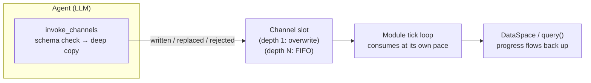
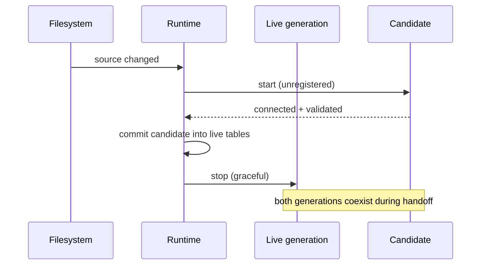

# NAN-itself

[](https://www.python.org/)
[](LICENSE)
[](https://github.com/DarkSpaceY/NAN-itself/actions/workflows/ci.yml)

A general-purpose, local-first autonomous agent framework. NAN-itself runs an
agent loop on your own machine, wiring an LLM to hot-reloadable tools (MCP
servers and in-process Python providers), ambient perception modules,
skills, and an HTTP gateway with a web UI.

> **NAN-itself is in early development.** Interfaces may change without notice.

## Features

- **Turn-based agent core** — every round is captured in a single `Turn`
  record (history snapshot + messages), so any round can be restored or
  inspected exactly as the model saw it.
- **Hot-reloadable tool providers** — two interchangeable kinds, reloaded
  live from source with zero restarts:
  - **MCP providers**: one YAML file = one stdio MCP server.
  - **Local providers**: one Python file = one in-process tool class.
- **Parallel builtin + workspace sources** — builtin and workspace tool
  directories are scanned with identical hot-reload semantics; deleting a
  source file disables its provider.
- **Ambient perception modules** — audio, vision (photometry → flow →
  faces → YOLO → OCR → VLM captioning), inbox, network and system modules
  run as background daemons and are queried by the agent.
- **Module channels (reactive modules)** — modules can declare write-only
  downlink data slots the model writes to through
  `list_channels` / `show_channels` / `invoke_channels`, enabling
  perceive → decide → act loops that run *inside* a module, at module
  frequency, with the LLM staying out of the hot path.
- **Skills** — hot-reloadable skill packages following the same
  builtin/workspace split.
- **Bounded by design** — every tool call is timeout-bounded, the only
  inbound listener is the gateway bound to `127.0.0.1`, and all repo paths
  resolve through a single path-anchoring module.

## Architecture



See [docs/architecture.md](docs/architecture.md) for the full picture.

### The turn loop

Each round is one LLM round-trip. The model sees a derived snapshot of
the previous round plus the newest observation; everything it produces
becomes the next round's snapshot. There is no separate history store.



### Modules and channels

Modules are background daemons: heavy work runs in `start()` loops and
`on_turn()`, while `query()` stays a cheap projection the agent reads
every turn. Modules that opt in also expose **channels** — write-only
slots the model fills with targets; the module consumes them at its own
tick. Data flows down, state flows up, and neither side blocks the other.



### Hot reload as a transaction

Sources (tools, modules, skills) reload live. A replacement is started
as an unregistered candidate and only committed after it is fully
connected — the old generation keeps serving until that moment, so a
broken edit never takes the runtime down.



## Quick start

Requirements: Python 3.12+ and [uv](https://docs.astral.sh/uv/).

```bash
git clone https://github.com/DarkSpaceY/NAN-itself.git
cd NAN-itself
uv sync

# Point the LLM settings at your provider, then start the agent:
# config/settings.yaml -> llm.api_key / llm.base_url / llm.model
uv run nan-itself
```

The gateway listens on `http://127.0.0.1:8765` by default; the web UI is
served from the same port. On first run the perception modules download
their model weights (`models/`, gitignored). A module whose weights are
missing or fail to load crashes loudly at start, shows the error, and
keeps retrying with backoff — it revives automatically once the weights
land. Nothing runs silently at half capacity.

## Development

```bash
uv sync              # installs the dev group (pytest) by default
uv run pytest -q     # full test suite
```

CI runs the framework/contract suite; tests that need local model
weights or the audio/vision backends are excluded there.

Contributor conventions (path anchoring, one-file-one-provider, hot-reload
contracts) are documented in [docs/development.md](docs/development.md)
and [CONTRIBUTING.md](CONTRIBUTING.md).

## Project layout

```
NAN-itself/
├── builtin/              # Shipped sources (hot-reloadable)
│   ├── modules/          # Ambient perception modules (audio, vision, ...)
│   ├── skills/           # Built-in skills
│   └── tools/
│       ├── mcps/         # MCP server configs (one YAML = one provider)
│       └── local/        # Local Python tool providers (one file = one provider)
├── workspace/            # User-editable overrides (same layout as builtin/)
├── config/               # settings.yaml and tool settings (e.g. searxng.yml)
├── backend/nan_itself/   # Framework source
│   ├── agent/            # Core agent loop (turns, engine, verbs)
│   ├── tools/            # Provider runtime (MCP + local backends, hot reload)
│   ├── modules/          # Module machinery (Facade, channels, persistence)
│   ├── skills/           # Skill machinery
│   ├── gateway.py        # HTTP gateway
│   └── utils/            # paths, backoff, vision/audio helpers
├── frontend/             # Demo web UI
├── models/               # Model weights (gitignored, auto-downloaded)
├── docs/                 # Documentation
└── tests/                # Pytest suite
```

## Documentation

| Document | Contents |
|---|---|
| [Core principles](docs/principles.md) | The load-bearing principles behind every design decision |
| [Architecture](docs/architecture.md) | Repo-mirrored tour: agent core, tool runtime, modules, skills, security model |
| [Configuration](docs/configuration.md) | `settings.yaml` reference and environment variables |
| [Development](docs/development.md) | Setup, conventions, adding tools and modules |
| [Reactive modules design](docs/design/reactive-modules.md) | The channel downlink design |
| [Tools](docs/tools.md) | Built-in tool reference *(placeholder)* |
| [Modules](docs/modules.md) | Built-in module reference *(placeholder)* |

## Built-in tools

> The tool surface is still evolving, so a detailed catalog is intentionally
> deferred. See [`builtin/tools/`](builtin/tools/) for the live sources:
> YAML MCP configs in `mcps/` and Python providers in `local/`.

## Built-in modules

> Same as above — the module set is still moving. See
> [`builtin/modules/`](builtin/modules/) for the live sources.

## License

[Apache-2.0](LICENSE)
