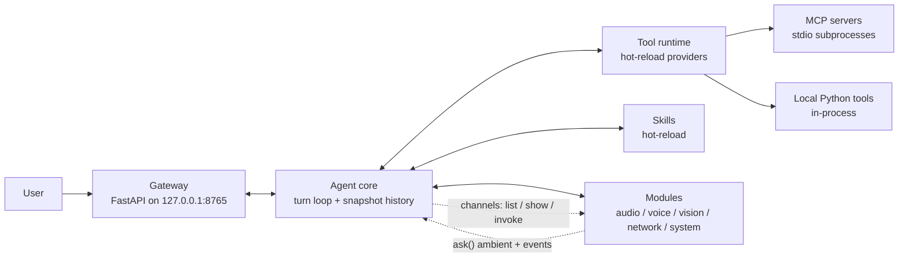

<p align="center">
  <picture>
    <source media="(prefers-color-scheme: dark)" srcset="docs/assets/nan-title-dark.png">
    
  </picture>
</p>

# NAN-itself

[](https://www.python.org/)
[](LICENSE)
[](https://github.com/DarkSpaceY/NAN-itself/actions/workflows/ci.yml)

A general-purpose, local-first autonomous agent framework. NAN-itself runs an
agent loop on your own machine, wiring an LLM to hot-reloadable tools (MCP
servers and in-process Python providers), ambient perception modules,
skills, and an HTTP gateway with a web UI.

> **NAN-itself is in early development.** Interfaces may change without notice.

## Documentation

The full documentation index is in [docs/README.md](docs/README.md); it is
organized so you can go straight to the page that matches what you need.

| Document | Contents |
|---|---|
| [First run](docs/tutorials/first-run.md) | End-to-end lesson: install, configure, start, converse |
| [Develop](docs/how-to/develop.md) | Setup, tests, conventions, pull requests |
| [Add a tool](docs/how-to/add-a-tool.md) | Create an MCP or local Python tool provider |
| [Add a module](docs/how-to/add-a-module.md) | Create an ambient or reactive module |
| [Add a skill](docs/how-to/add-a-skill.md) | Create a skill package |
| [Core principles](docs/explanation/principles.md) | The load-bearing principles behind every design decision |
| [Architecture](docs/explanation/architecture.md) | How the system is shaped, and why |
| [Configuration](docs/reference/configuration.md) | core `settings.yaml` + per-module `config/modules/*.yaml` reference |
| [Tools](docs/reference/tools.md) | Tool subsystem reference: provider kinds, reload, verbs |
| [Skills](docs/reference/skills.md) | Skill subsystem reference: format, discovery, resources |
| [Modules](docs/reference/modules.md) | Module subsystem reference: surface, lifecycle, DataSpace, channel downlink |

## Features

- **Turn-based agent core** — every round is captured in a single
  structured `Turn` record (history snapshot + the round's reply, calls
  and results), so any round can be restored or inspected exactly as the
  model saw it.
- **Hot-reloadable tool providers** — two interchangeable kinds, reloaded
  live from source with zero restarts:
  - **MCP providers**: one YAML file = one stdio MCP server.
  - **Local providers**: one Python file = one in-process tool class.
- **Parallel builtin + workspace sources** — builtin and workspace tool
  directories are scanned with identical hot-reload semantics; deleting a
  source file disables its provider.
- **Ambient perception modules** — audio, vision (photometry → flow →
  faces → YOLO → OCR → VLM captioning), inbox, network and system modules
  run as background daemons and contribute ambient context every turn.
- **Module channels (reactive modules)** — modules can declare downlink
  channels the model writes to through
  `list_channels` / `show_channels` / `invoke_channels`, enabling
  perceive → decide → act loops that run *inside* a module, at module
  frequency, with the LLM staying out of the hot path.
- **Skills** — hot-reloadable skill packages following the same
  builtin/workspace split.
- **Bounded by design** — every tool call is timeout-bounded, the only
  inbound listener is the gateway bound to `127.0.0.1`, and all repo paths
  resolve through a single path-anchoring module.

## Architecture


```mermaid
flowchart LR
    U[User] --> G[Gateway<br/>FastAPI on 127.0.0.1:8765]
    G <--> C[Agent core<br/>turn loop + snapshot history]
    C <--> T[Tool runtime<br/>hot-reload providers]
    T --> MCP[MCP servers<br/>stdio subprocesses]
    T --> LP[Local Python tools<br/>in-process]
    C <--> SK[Skills<br/>hot-reload]
    C <--> MD[Modules<br/>audio / voice / vision / network / system]
    C -. "channels: list / show / invoke" .-> MD
    MD -. "ask() ambient + events" .-> C
```

See [docs/explanation/architecture.md](docs/explanation/architecture.md) for the
turn loop, module channels, and hot reload explained in full.

## Quick start

Requirements: Python 3.12+ and [uv](https://docs.astral.sh/uv/).

```bash
git clone https://github.com/DarkSpaceY/NAN-itself.git
cd NAN-itself
uv sync --all-extras

# Point the LLM settings at your provider, then start the agent:
# config/settings.yaml -> llm.api_key / llm.base_url / llm.model
uv run nan-itself
```

The gateway listens on `http://127.0.0.1:8765` by default; the web UI is
served from the same port. On first run the perception modules download
their model weights (`models/`, gitignored). A module whose weights are
missing or fail to load crashes loudly at start, shows the error, and
keeps retrying with backoff — it revives automatically once the weights
land. Nothing runs silently at half capacity.

## Development

```bash
uv sync --all-extras # framework + dev group + the builtin plugins' deps
uv run pytest -q     # full test suite
```

CI runs the framework/contract suite. Tests for the builtin content —
the shipped modules and tools that pull in the full local-inference
stack — live in `tests/builtin/` and are excluded there.

Contributor conventions (path anchoring, one-file-one-provider, hot-reload
contracts) are documented in
[docs/how-to/develop.md](docs/how-to/develop.md).

## Project layout

```
NAN-itself/
├── builtin/              # Shipped sources (hot-reloadable)
│   ├── modules/          # Ambient + reactive modules (audio, voice, vision, ...)
│   ├── skills/           # Built-in skills
│   └── tools/
│       ├── mcps/         # MCP server configs (one YAML = one provider)
│       └── local/        # Local Python tool providers (one file = one provider)
├── workspace/            # User-editable overrides (same layout as builtin/)
├── config/               # settings.yaml, per-module configs, tool settings (e.g. searxng.yml)
├── backend/nan_itself/   # Framework source
│   ├── agent/            # Core agent loop (turns, engine, verbs)
│   ├── tools/            # Provider runtime (MCP + local backends, hot reload)
│   ├── modules/          # Module machinery (Facade, channels, persistence)
│   ├── skills/           # Skill machinery
│   ├── gateway.py        # HTTP gateway
│   └── utils/            # paths, backoff, vision/audio helpers
├── frontend/             # Demo web UI
├── models/               # Model weights (gitignored, auto-downloaded)
├── docs/                 # Documentation
└── tests/                # Pytest suite
```

## License

[Apache-2.0](LICENSE)
