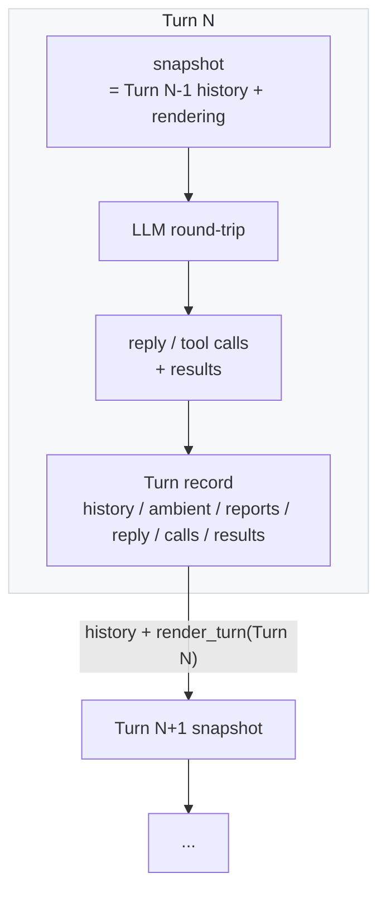
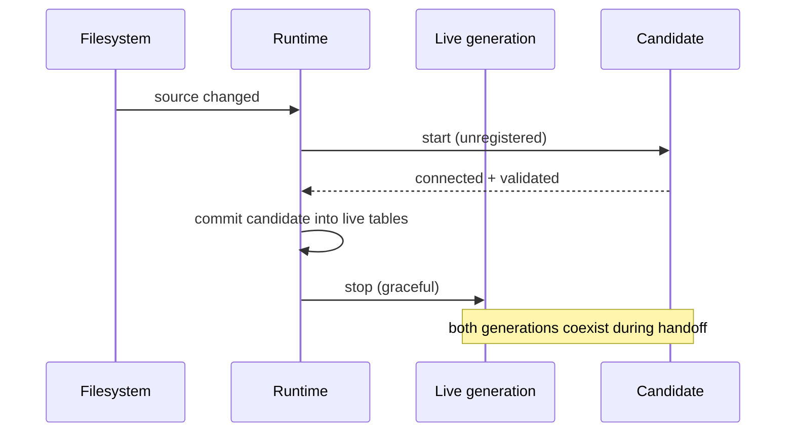
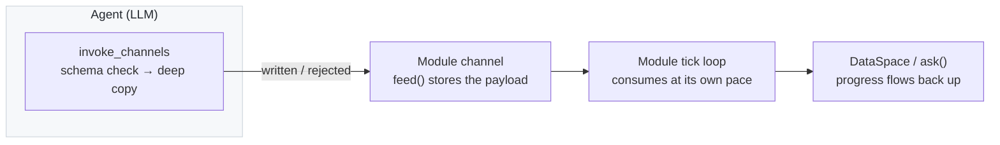

# Architecture

This document explains how NAN-itself is put together and why it is
shaped the way it is, section by section, following the repository
layout. It mirrors the code as of the current development state;
interfaces may still change.

For the design principles that constrain these decisions, see
[principles.md](principles.md). For exact interfaces and contracts, see
the [reference](../reference/) documents.

## Repository layout

```
NAN-itself/
├── backend/nan_itself/   # Framework source (Python package `nan_itself`)
├── builtin/              # Shipped tools / modules / skills
├── workspace/            # User-editable tools / modules / skills + persona
├── config/               # settings.yaml, searxng.yml
├── frontend/             # Demo web UI (not covered here; likely to be rebuilt)
├── infraend/             # Planned infra backend (not covered here)
├── models/               # Downloaded model weights (runtime-managed)
├── docs/                 # This documentation
└── tests/                # Contract and integration tests
```

## backend/nan_itself/

The Python package. Flat modules at its root, one subpackage per
subsystem. Import discipline: everything anchors to the package location
(`utils/paths.py`), never to the process working directory.

### app.py — composition root

`app.py` is the composition root. It loads `config/settings.yaml`
(`config.py`), anchors all repo-relative directories through
[`utils/paths.py`](../../backend/nan_itself/utils/paths.py), and
constructs the `ProviderRuntime`, the module `Facade`, the
`SkillRuntime`, the `StepEngine` and the root `Agent`. It then starts the
tool provider runtime and the module facade before launching the agent
loop and the gateway (FastAPI/uvicorn) as two long-lived tasks. Shutdown
reverses that order — modules stop before providers, because modules may
still reference tool providers.

### agent/ — the turn loop

- **Turn is the sole record of a round** (`model.py`). A `Turn` carries
  everything as structure: `persona` and `history` (the snapshot the
  model saw), the observation inputs (`task`, `world`, `ambient` — the
  Modules' per-turn context, `reports` — harvested child reports), and
  the round's flow (`reply`, `calls` with `results`, one per call), plus
  `usage`, `finish_reason` and `model`. No message lives on the Turn and
  there is no separate persistent history.
- **Snapshot derivation** (`engine.py`). The next round's snapshot is
  derived as `last_turn.history + render_turn(last_turn)`; rendering a
  turn into model messages is the exclusive job of `agent/prompts.py`
  (`build_messages` / `render_turn`), and the engine is its only caller.
  When the character budget is exceeded the snapshot is truncated to an
  empty tuple — the model then sees only the system prompt plus the
  newest observation and the chain restarts from there.
- **Core state** (`core.py`). The core holds a single `last_turn`
  reference, replaced after each successful run and kept on failure, so
  a failed round can be inspected as-is.
- **Subagents** (`runtime.py`) run the same engine inside a `while
  True` loop with no round limit; the loop only exits when the `finish`
  tool sets the finished state. The `finish` tool is visible only at
  depth > 0 and a finish report must be non-empty.
- **Verbs** (`verbs.py`). Every interface face is reached through a
  `list_*` / `show_*` / `invoke_*` verb triple: tools, skills, and
  module channels all follow the same mental model — list enumerates,
  show inspects, invoke acts.

Each round is one LLM round-trip. The model sees a derived snapshot of
previous rounds plus the newest observation; the engine renders each
completed round and appends it to the next round's snapshot. There is no
separate history store.



### tools/ — provider runtime

[`runtime.py`](../../backend/nan_itself/tools/runtime.py)
(`ProviderRuntime`) reconciles sources across two parallel directory
layouts — builtin (`builtin/tools/`) and workspace
(`workspace/tools/`) — with identical hot-reload semantics:

- **One file = one provider.** An MCP YAML file declares exactly one
  stdio server (`name` / `command` / `args` / `env` / `cwd`; a relative
  `cwd` is repo-anchored, never process-cwd-anchored). A local Python
  file contains exactly one `ToolSet` subclass, marked with a
  `# @tool` header in its first 20 lines.
- **Reload transaction.** Replacement workers are first started as
  unregistered candidates; only after a candidate is fully connected is
  it committed into the live tables and the old generation asked to
  stop. Old and new generations of the same provider name can therefore
  coexist during the handoff.
- **Bounded calls.** Every tool call (local or MCP) is wrapped in a
  timeout (300 s by default, `providers.tool_timeout` in settings) and
  surfaces timeouts as error results instead of hanging the agent loop.
- **Local tools** derive their JSON schema from type annotations via
  `@tool`-decorated methods; return values are JSON-serialized into the
  tool result, raised exceptions become error results.
- A dedicated supervisor task reaps dead MCP workers and reschedules
  their sources with backoff; a degraded provider never kills the
  runtime.

Sources (tools, modules, skills) reload live. A replacement is started
as an unregistered candidate and only committed after it is fully
connected — the old generation keeps serving until that moment, so a
broken edit never takes the runtime down.



See [tools.md](../reference/tools.md) for the full contract.

### modules/ — ambient state and channels

Builtin modules (`builtin/modules/`) provide ambient context the
engine asks for at every turn start. The machinery here
(`runtime.py` = the Facade) owns:

- dependency graph, lifecycle supervision, retry and hot reload;
- DataSpace ownership: a module publishes, dependents read detached
  snapshots (`deps.py`);
- per-turn coupling: `ask()` ambient projection at turn start and
  `tell()` notification after it (`model.py` defines `Turn` and
  `Module`);
- private state persistence via `serialize_state()` (`persistence.py`);
- **channels** (`model.py`): modules that declare a `channels` mapping
  on the class expose downlink endpoints the model reaches through the
  `list_channels` / `show_channels` / `invoke_channels` verbs; see
  [modules.md](../reference/modules.md) for the channel contract.

Module-side contracts: capture/inference work runs on daemon threads
with interval gating; the per-turn surface is a pure `ask()`
projection; provisioning failures (e.g. missing model weights) raise
out of `start()` — the Facade marks the module DOWN with the error and
restarts it with backoff, so a module with missing weights comes up
loudly failed and revives once the weights land (all weights are
provisioned in `start()`, before any loop runs). One event loop runs
every coroutine: `tell()` may await long operations, but synchronous
CPU-heavy or blocking calls go to a thread, `DataSpace` publishes stay
small JSON facts (publish/snapshot deepcopy the full state on the loop
every round), and provisioning-length work (weight loading, device
probing) happens on `start()`'s background threads.

Modules are background daemons: heavy work runs in `start()` loops and
`tell()`, while `ask()` stays a cheap projection the engine reads every
turn. Modules that opt in also declare **channels** — downlink endpoints
the model feeds payloads into; the module consumes them at its own
tick. Data flows down, state flows up, and neither side blocks the other.



### skills/ — capability packages

A skill is a directory with a `SKILL.md` (YAML frontmatter) plus
optional `scripts/`, `references/`, `assets/` folders (`model.py`).
The runtime (`runtime.py`) discovers skills from the same parallel
builtin/workspace roots at boot, re-scans at every turn start (shared
hot-reload logic), and applies progressive disclosure: metadata lookups
never load bodies; invoking a script executes it, other resources
return as text. See [skills.md](../reference/skills.md) for the skill
format and runtime surface.

### gateway and events

`gateway.py` serves the HTTP API on `gateway.host:gateway.port`
(default `127.0.0.1:8765`) and bridges to the web UI in `frontend/`.
`events.py` implements the in-process pub/sub bus with bounded history
and subscriber queues.

## builtin/ and workspace/

Two parallel provider layouts, scanned with identical semantics —
`builtin/` ships with the repo, `workspace/` is user territory
(deleting a source file removes its provider; edits hot-reload).

| Slot | Builtin | Workspace |
|---|---|---|
| Tools | `builtin/tools/` (`local/` Python, `mcps/` YAML) | `workspace/tools/` (same shape, starts empty) |
| Modules | `builtin/modules/` (audio, voice, vision, network, system, inbox) | `workspace/modules/` |
| Skills | `builtin/skills/` | `workspace/skills/` |

`workspace/persona.md` holds the user-editable persona;
`workspace/desktop/` is reserved for the agent's "virtual desktop"
(planned).

## config/

Core configuration lives in `config/settings.yaml` (loaded by
`config.py`); each Module owns `config/modules/<module_id>.yaml`
and loads and validates it itself, keeping modules independent of
any shared config machinery; `searxng.yml` configures the bundled
SearxNG instance used by the search tool. There are no
environment variables. See [configuration.md](../reference/configuration.md).

## tests/

Contract tests mirror the reload/consistency guarantees
(`test_reload_*.py`, `test_turn_consistency.py`, `test_layering.py`),
plus integration tests that run the real agent loop against isolated
module/tool directories.

## Security

The security model and the trust boundaries are documented in
[SECURITY.md](../../SECURITY.md); that file is the authoritative
reference for what NAN-itself trusts and what it does not.
